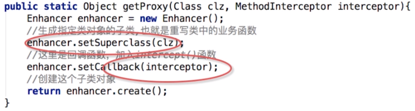
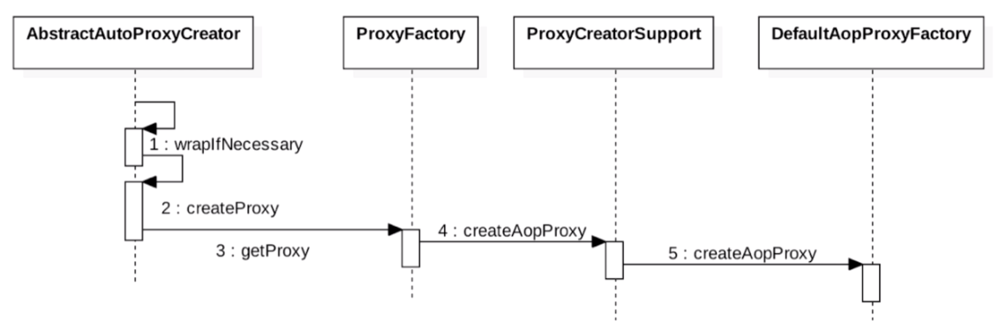
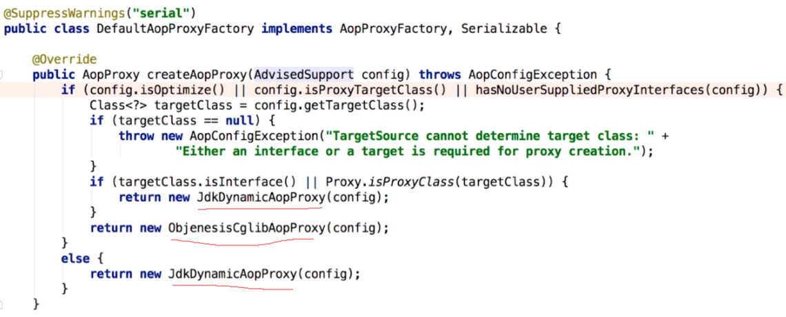
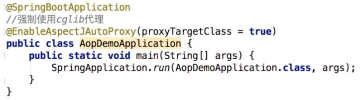
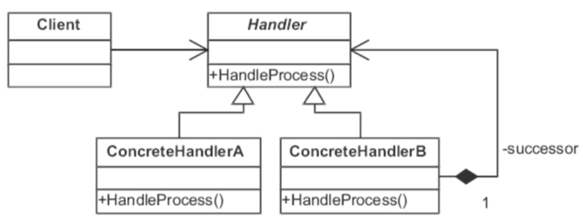
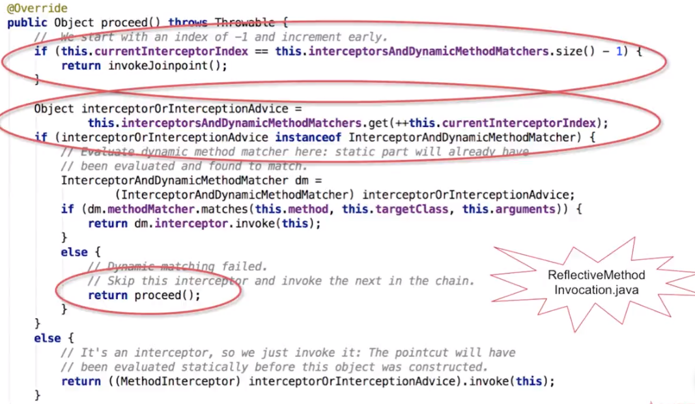

原理概述：织入的时机
1.编译器（AspectJ）
2.类加载时（AspectJ 5即以上版本）
3.运行时织入（Spring AOP）

 AspectJ是一个AOP框架，它能够对java代码进行AOP编译（一般在编译期进行），让java代码具有AspectJ的AOP功能（当然需要特殊的编译器），可以这样说AspectJ是目前实现AOP框架中最成熟，功能最丰富的语言，更幸运的是，AspectJ与java程序完全兼容，几乎是无缝关联，因此对于有java编程基础的工程师，上手和使用都非常容易。Spring注意到AspectJ在AOP的实现方式上依赖于特殊编译器(ajc编译器)，因此Spring很机智回避了这点，转向采用动态代理技术的实现原理来构建Spring AOP的内部机制（动态织入），这是与AspectJ（静态织入）最根本的区别。Spring 只是使用了与 AspectJ 5 一样的注解，但仍然没有使用 AspectJ 的编译器，底层依是动态代理技术的实现，因此并不依赖于 AspectJ 的编译器。 Spring AOP虽然是使用了那一套注解，其实实现AOP的底层是使用了动态代理(JDK或者CGLib)来动态植入。至于AspectJ的静态植入，不是本文重点，所以只提一提。

运行时织入如何实现的？  代理模式
从静态代理到动态代理
静态代理缺点：1.对于每个类都要有代理类。2.接口新增方法时，代理类要增加新方法的实现，动态代理的代理类就不用修改。
动态代理实现：基于接口代理和基于继承的代理。对应的实现的代表：JDK代理和CGlib代理
老版本的JDK代理速度越是慢，但在jdk1.8以后JDK代理速度已经可以超越CGlib了。https://blog.csdn.net/xlgen157387/article/details/82497594
JDK实现要点：只能基于接口进行动态代理
类：java.lang.reflect.Proxy
接口：InvocationHandler
JDK代理源码解析：（详情看Proxy.newProxyInstance源码）
Proxy.newProxyInstance -> getProxyClass0 ->如果缓存里没有则使用 ProxyClassFactory() -> ProxyGenerator.generateProxyClass 来生成字节码(byte数组) -> newInstance使用反射new出实例
使用System.getProperties().put("sun.misc.ProxyGenerator.saveGeneratedFiles", "true");可以保存动态生成的代理类，执行后发现代理类中果然生成了接口中定义的实现方法。

CGlib实现
CGlib通过继承方式实现代理类，通过callback MethodInterceptor织入我们想要的代码

MethodInterceptor与JDK代理中的InvocationHandler很像

JDK与CGlib代理对比：
1.JDK只能追对有接口的类的接口方法进行动态代理，不能对static，private方法代理（因为接口方法不能是private）
2.CGlib基于继承实现代理，无法对于static，final类进行代理
3.CGlib基于继承实现代理，无法对于static，private方法进行代理

如果目标对象实现了接口，则默认采用JDK动态代理
如果目标对象没有实现接口，则采用CGlib动态代理
如果目标实现了接口，但强制了CGlib代理，则采用CGlib动态代理。如下图

多个AOP作用同一个目标时是如何叠加的？ 责任链模式

看Spring源码确实是使用责任链模式来确定先后顺序的
